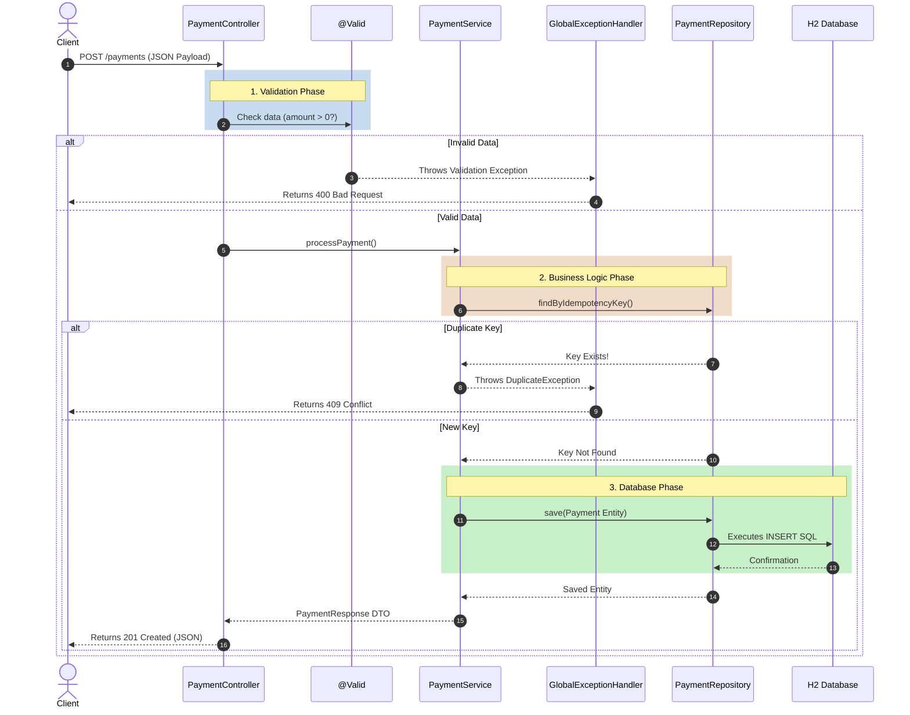
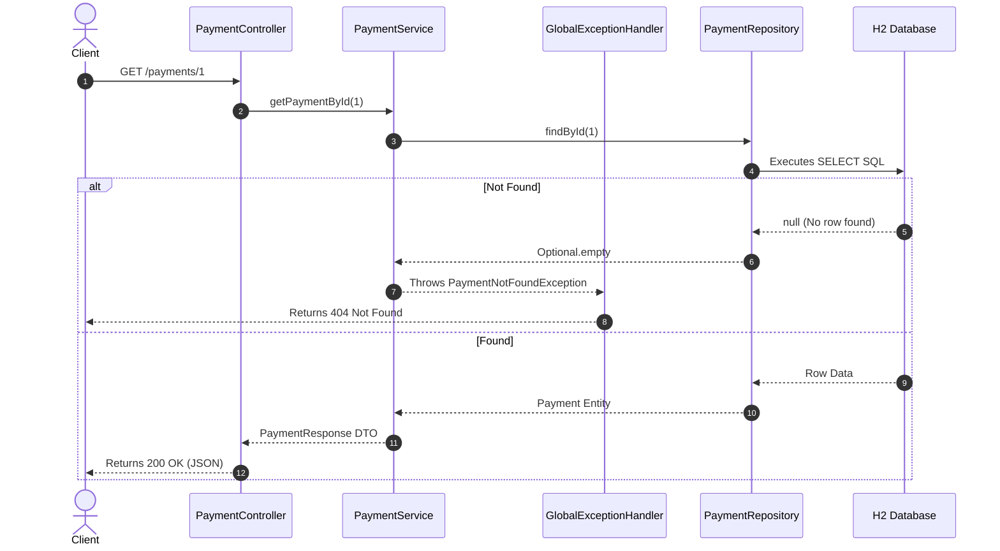

# Spring Boot Workflow Guide: POST vs GET

Understanding how data flows through a Spring Boot application is the most important concept in Backend Engineering. We use a **3-Tier Architecture**:
1. **Controller Tier (The Receptionist):** Handles HTTP traffic and routing.
2. **Service Tier (The Chef):** Handles the core business logic and rules.
3. **Repository Tier (The Filing Clerk):** Handles database communication.

Here is exactly what happens step-by-step when you hit our API.

---

## 1. The POST Request Workflow (Creating Data)

When a customer sends a `POST /api/v1/payments` request, they are asking us to save new data. This is a complex flow because we must validate the data, check for duplicates, and save it securely.

> [!TIP]
> Follow the arrows below from top to bottom. Notice how the **Global Exception Handler** acts as a safety net. If an error occurs at *any* stage, the handler catches it and returns a polite error to the Client.

### Detailed Breakdown (POST):
1. **The Request:** The Client sends JSON data (amount, account number) to the Controller over the internet.
2. **The Bouncer (`@Valid`):** Before the Controller even processes the request, Spring runs the data through our DTO rules. If the amount is negative, the Bouncer kicks it out, triggering our `GlobalExceptionHandler`.
3. **The Chef (`PaymentService`):** The Controller hands the valid data to the Service. The Service applies our core FinTech rule: *Idempotency*. It asks the Repository if this ticket number already exists.
4. **The Filing Clerk (`PaymentRepository`):** If the ticket is new, the Service maps the data to our `Payment` Entity and tells the Repository to save it. The Repository translates this into SQL and writes it to the H2 database.
5. **The Receipt:** The Service takes the saved data, packages it neatly into a `PaymentResponse` DTO, and gives it back to the Controller.
6. **The Response:** The Controller hands the DTO back to the Client with an HTTP `201 Created` status code.

---

## 2. The GET Request Workflow (Retrieving Data)

When a customer sends a `GET /api/v1/payments/1` request, they are simply asking to read data. This flow is much simpler because we don't need to validate incoming JSON payloads or worry about saving things.

### Detailed Breakdown (GET):
1. **The Request:** The Client types the URL in the browser. The browser sends a GET request. The `@PathVariable` in the Controller extracts the `1` from the URL.
2. **The Lookup:** The Controller asks the Service for payment ID 1. The Service immediately asks the Repository.
3. **The Database Query:** The Repository executes a `SELECT * FROM payments WHERE id = 1` query against the database.
4. **The Error Handling:** If the database says "I don't have that", the Service throws a `PaymentNotFoundException`. The `GlobalExceptionHandler` catches this and politely returns a `404 Not Found`.
5. **The Success:** If the database finds it, the Service maps the Entity to a clean `PaymentResponse` DTO and the Controller returns it with a `200 OK` status code.
