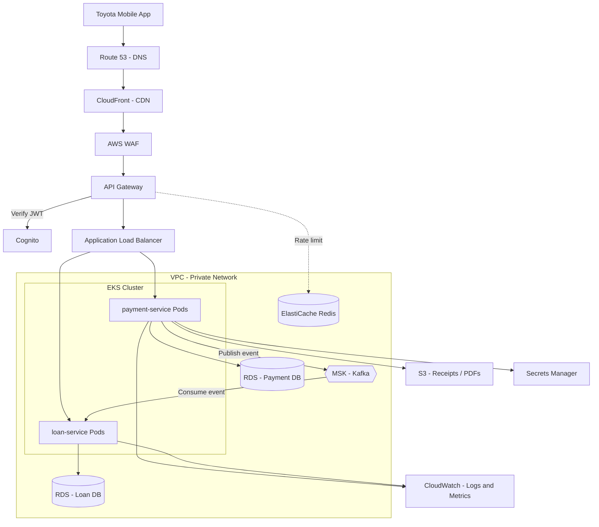

# AWS for Backend Engineers (TFS Perspective)

This guide explains how AWS connects to everything we built locally (Spring Boot, Kafka, H2, Redis, API Gateway, Docker) and covers each AWS service a Backend Engineer at Toyota Financial Services is likely to touch.

## How to read this guide (Scope Tags)

AWS has 200+ services. You do **not** need to know them all.

| Tag | Meaning |
|---|---|
| ✅ **Core BE** | You will use, configure, or debug this regularly. Know it well. |
| 🟡 **Good to know** | You won't build or manage it, but you need the concept to debug and discuss it in interviews. |
| ❌ **Beyond scope** | DevOps / Cloud / Security team owns it. A one-line understanding is enough. |

---

## 1. The Big Picture: What is AWS?

AWS (Amazon Web Services) is **renting someone else's data center by the minute**. Instead of Toyota buying servers, cooling them, and hiring people to replace broken hard drives, they rent compute, storage, databases, and networking from Amazon.

Everything we ran on your laptop has a "managed" AWS equivalent:

| What we built locally | AWS production equivalent | Tag |
|---|---|---|
| Running the JAR in IntelliJ | **EKS** (Kubernetes) or **ECS/Fargate** running Docker containers | ✅ / 🟡 |
| Docker images on your laptop | **ECR** (Elastic Container Registry) | 🟡 |
| H2 in-memory database | **RDS / Aurora PostgreSQL** | ✅ |
| Kafka + Zookeeper in docker-compose | **MSK** (Managed Streaming for Kafka) | ✅ |
| Redis container (rate limiter) | **ElastiCache for Redis** | ✅ |
| Spring Cloud Gateway (port 9000) | **AWS API Gateway** + **ALB** | ✅ / 🟡 |
| No firewall | **AWS WAF** | 🟡 |
| No login | **Amazon Cognito** | 🟡 |
| `application.properties` secrets | **Secrets Manager / Parameter Store** | ✅ |
| Console logs in IntelliJ | **CloudWatch Logs** (or Datadog/Splunk) | ✅ |
| `localhost` | **Route 53** DNS + **VPC** networking | 🟡 / ❌ |

---

## 2. Production Architecture on AWS



---

## 3. Foundations (The Ground Everything Sits On)

### 3.1 Regions and Availability Zones — 🟡 Good to know
*   **Region:** A geographic area, e.g., `us-east-1` (N. Virginia), `us-west-2` (Oregon).
*   **Availability Zone (AZ):** One or more physically separate data centers inside a Region (e.g., `us-east-1a`, `us-east-1b`).
*   **Why you care:** TFS deploys every service across **at least 2-3 AZs**. If one data center loses power, the pods and databases in the other AZs keep serving traffic. When someone says "multi-AZ", this is what they mean.

### 3.2 VPC (Virtual Private Cloud) — 🟡 Good to know
A VPC is TFS's **private, isolated network** inside AWS. Think of it as the company's own walled compound.
*   **Public Subnets:** Things that must face the internet (Load Balancers).
*   **Private Subnets:** Things that must never face the internet (your Spring Boot pods, RDS, MSK, Redis).
*   **Security Groups:** Virtual firewalls on each resource. Example rule: *"RDS only accepts traffic on port 5432 from the payment-service pods."*

> **Why a BE engineer cares:** The #1 cause of `Connection timed out` errors when your service can't reach RDS/MSK/Redis is a **Security Group rule missing**. You won't fix it yourself, but you must recognize it and tell the DevOps team.

### 3.3 IAM (Identity and Access Management) — ✅ Core BE
IAM controls **who (or what) is allowed to do what** in AWS.
*   **User:** A human (you logging into the AWS Console).
*   **Role:** An identity that a *machine* assumes. Your `payment-service` pod runs with an IAM Role (via **IRSA** - IAM Roles for Service Accounts on EKS).
*   **Policy:** A JSON document listing allowed actions, e.g., *"payment-service may `s3:PutObject` into bucket `tfs-receipts` and `secretsmanager:GetSecretValue` for `payment-db-credentials`."*
*   **Least Privilege:** Grant only what's needed, nothing more.

> **Why a BE engineer cares:** When your code calls S3 or Secrets Manager and gets `AccessDeniedException`, it's an IAM policy issue. You'll often need to specify exactly which permissions your service needs. **Never hardcode AWS access keys in code** — the pod's IAM Role provides credentials automatically.

---

## 4. Compute (Where Your Code Runs)

### 4.1 EC2 (Elastic Compute Cloud) — 🟡 Good to know
A **virtual server** you rent by the hour. You pick the CPU/RAM size, OS, and you're responsible for patching, scaling, and installing Java.
*   **Used at TFS for:** Usually the underlying worker nodes *beneath* EKS. You rarely SSH into EC2 directly anymore.

### 4.2 EKS (Elastic Kubernetes Service) — ✅ / 🟡
**Managed Kubernetes.** AWS runs the Control Plane (the Brain); TFS runs worker nodes (EC2) that host your pods.
*   **What you do (✅):** Read your service's Kubernetes YAML (replicas, CPU/memory limits, env vars, health checks), run `kubectl logs` / `kubectl describe pod`, understand restarts and `OOMKilled`.
*   **What you don't do (❌):** Create the cluster, upgrade Kubernetes versions, manage nodes.

### 4.3 ECS & Fargate — 🟡 Good to know
*   **ECS:** AWS's own simpler alternative to Kubernetes for running containers.
*   **Fargate:** "Serverless containers" — you give AWS a Docker image, and it runs it without you managing any EC2 servers.
*   Some TFS teams may use ECS/Fargate instead of EKS. Conceptually it's the same idea: run Docker containers at scale.

### 4.4 Lambda — ✅ Core BE (when used)
**Serverless functions.** You upload a small piece of code; AWS runs it **only when triggered**, and you pay per millisecond of execution.
*   **Triggers:** An S3 upload, an SQS message, an API Gateway call, a schedule (cron).
*   **Good for:** Small, event-driven, short tasks. e.g., *"When a PDF receipt is uploaded to S3, generate a thumbnail"* or *"Every night at 2 AM, send overdue-payment reminders."*
*   **Bad for:** Long-running services, heavy Spring Boot apps (slow "cold starts" — the first call after idle can take seconds while the JVM boots).

### Compute Comparison

| | EC2 | EKS / ECS | Lambda |
|---|---|---|---|
| **What you manage** | Everything (OS, Java, scaling) | Containers + configs | Just the function code |
| **Runs** | 24/7 | 24/7 | Only when triggered |
| **Best for** | Legacy apps | Microservices (our Spring Boot apps) | Small event-driven tasks |
| **Billing** | Per hour | Per node / per task | Per request + ms |

---

## 5. Edge & Networking (The Front Door)

### 5.1 Route 53 — ❌ Beyond scope
AWS's **DNS service**. Translates `api.toyotafinancial.com` → the Load Balancer's address. Can also route users to the nearest/healthiest region.

### 5.2 CloudFront — 🟡 Good to know
AWS's **CDN**. Caches static content (images, JS bundles, PDFs) at hundreds of edge locations worldwide so users get them fast. Frontend teams use it heavily; backend APIs sometimes sit behind it too.

### 5.3 AWS WAF — 🟡 Good to know
The **Layer-7 firewall** (see `TFS_SYSTEM_DESIGN.md`). Blocks SQL injection, XSS, bad IPs, and bots before they reach your services. Security team configures the rules.

### 5.4 API Gateway — ✅ Core BE
The **managed front door** for your APIs. Replaces our local Spring Cloud Gateway in many setups.
*   Validates **JWT tokens** (integrates natively with Cognito).
*   **Throttling / rate limiting** per client or API key.
*   **Routes** `/api/v1/payments/**` → payment-service, `/api/v1/loans/**` → loan-service.
*   **Why you care:** When a user reports a `401`, `403`, `429`, or `504 Gateway Timeout`, the API Gateway logs are the first place to check.

### 5.5 ALB (Application Load Balancer) — 🟡 Good to know
Distributes HTTP traffic across your healthy pods. It calls your **health check endpoint** (e.g., Spring Boot Actuator's `/actuator/health`). If your app's health check fails, the ALB stops sending it traffic.

> **Why a BE engineer cares:** If your `/actuator/health` returns `DOWN` (e.g., because the DB connection fails), your pod gets pulled out of rotation. Exposing a correct health endpoint is *your* job.

---

## 6. Data & Storage

### 6.1 RDS / Aurora (Relational Database Service) — ✅ Core BE
**Managed PostgreSQL/MySQL.** Replaces our H2 database.
*   AWS handles backups, patching, failover, and read replicas.
*   **Multi-AZ:** A standby copy in another AZ takes over automatically if the primary fails.
*   **Read Replicas:** Extra read-only copies to offload heavy `SELECT` queries (e.g., reporting).
*   **Aurora:** Amazon's high-performance, PostgreSQL-compatible engine. Faster and auto-scaling storage.

**What changes in your code:** Almost nothing! Spring Data JPA is database-agnostic. You change `application.properties`:
```properties
spring.datasource.url=jdbc:postgresql://payment-db.xxxx.us-east-1.rds.amazonaws.com:5432/payments
spring.datasource.username=${DB_USERNAME}   # injected from Secrets Manager
spring.datasource.password=${DB_PASSWORD}   # injected from Secrets Manager
spring.jpa.hibernate.ddl-auto=validate      # never 'create' or 'update' in prod
```
Schema changes are done with migration tools like **Flyway** or **Liquibase** (✅ you write these scripts).

### 6.2 DynamoDB — ✅ Core BE (when used)
AWS's **NoSQL key-value / document database**. Single-digit millisecond reads at any scale, no servers to manage.
*   **Good for:** High-volume lookups by key — user sessions, idempotency keys, audit logs, device data.
*   **Key concept:** You design tables around your **access patterns** (Partition Key + Sort Key), not around relationships. No `JOIN`s.

### 6.3 ElastiCache (Redis) — ✅ Core BE
**Managed Redis.** Replaces our local Redis container.
*   Used for **caching** (Spring's `@Cacheable`), **rate limiting** (our API Gateway token bucket), and **distributed locks**.
*   **Why you care:** You decide *what* to cache and the **TTL** (time-to-live). Stale cache data is a classic bug source.

### 6.4 S3 (Simple Storage Service) — ✅ Core BE
**Object storage for files.** Infinitely scalable, extremely durable (99.999999999%, "11 nines").
*   **Bucket:** A top-level container (e.g., `tfs-payment-receipts`).
*   **Object:** A file + metadata, addressed by a key (e.g., `2026/10/receipt-12345.pdf`).
*   **Used at TFS for:** Payment receipts, loan agreement PDFs, customer-uploaded documents, data exports, application backups.
*   **Pre-signed URLs (✅ important):** Instead of streaming a 10MB PDF through your Spring Boot service, your service generates a temporary, secure URL that lets the mobile app download directly from S3 for, say, 5 minutes.
*   **Never** store files as BLOBs in RDS — store them in S3 and save only the S3 key in the database.

```java
// Example: uploading a receipt using AWS SDK v2
s3Client.putObject(
    PutObjectRequest.builder()
        .bucket("tfs-payment-receipts")
        .key("receipts/" + paymentId + ".pdf")
        .build(),
    RequestBody.fromBytes(pdfBytes)
);
```

---

## 7. Messaging & Eventing

### 7.1 MSK (Managed Streaming for Apache Kafka) — ✅ Core BE
**Managed Kafka.** Replaces our docker-compose Kafka. Your `@KafkaListener` and `KafkaTemplate` code stays **exactly the same** — only `bootstrap-servers` changes (plus TLS/IAM auth settings).
```properties
spring.kafka.bootstrap-servers=b-1.tfs-msk.xxxx.kafka.us-east-1.amazonaws.com:9098
```

### 7.2 SQS (Simple Queue Service) — ✅ Core BE
A simple, fully managed **message queue**. One message → processed by one consumer → deleted.
*   Has built-in **Dead Letter Queues**, just like the DLQ we built for Kafka.
*   **Good for:** Background jobs (send email, generate PDF), decoupling a service from a slow downstream system.

### 7.3 SNS (Simple Notification Service) — ✅ Core BE
**Pub/Sub fan-out.** One message published → delivered to many subscribers (SQS queues, Lambdas, emails, SMS).
*   **Classic pattern — SNS + SQS fan-out:** "PaymentCompleted" is published to SNS → copied into the Loan queue, the Email queue, and the Analytics queue.

### 7.4 EventBridge — 🟡 Good to know
A serverless **event bus** that routes events based on rules (e.g., *"if event.type == PaymentFailed, trigger this Lambda"*). Also used for scheduled (cron) jobs.

### Kafka (MSK) vs SQS vs SNS

| | MSK (Kafka) | SQS | SNS |
|---|---|---|---|
| **Model** | Log / stream | Queue | Pub/Sub push |
| **Message after read** | Kept (replayable) | Deleted | Not stored |
| **Multiple consumers** | Yes (consumer groups) | No (one consumer per message) | Yes (fan-out) |
| **Ordering** | Per partition | FIFO queues only | FIFO topics only |
| **Best for** | High-volume event streaming, replay | Background jobs | Notifications, fan-out |

---

## 8. Security Services

### 8.1 Cognito — 🟡 Good to know
**Managed user sign-up/login.** Stores passwords, handles MFA, and issues the **JWT tokens**. Your services only *verify* the tokens (using Cognito's public keys from its JWKS URL):
```yaml
spring:
  security:
    oauth2:
      resourceserver:
        jwt:
          issuer-uri: https://cognito-idp.us-east-1.amazonaws.com/us-east-1_XXXXXX
```
That single property is often all a Spring Boot service needs to validate Cognito JWTs. ✅ *Configuring this is your job.*

### 8.2 Secrets Manager / Parameter Store — ✅ Core BE (consuming)
Secure vaults for DB passwords, API keys, and other config.
*   **Your job (✅):** Read secrets at startup (via Spring Cloud AWS, or Kubernetes injects them as environment variables). Never commit secrets to Git.
*   **Not your job (❌):** Creating, rotating, and managing access to the secrets.

### 8.3 KMS (Key Management Service) — ❌ Beyond scope
Manages the encryption keys used to encrypt S3 buckets, RDS disks, and secrets at rest. You just need to know "data at rest is encrypted with KMS."

---

## 9. Observability (Seeing What's Happening)

### 9.1 CloudWatch — ✅ Core BE
*   **Logs:** Everything your app writes via `log.info(...)` ends up here (or in Datadog/Splunk). Search by `paymentId`, `traceId`, etc.
*   **Metrics:** CPU, memory, request counts, error rates, Kafka consumer lag.
*   **Alarms:** "If 5xx errors > 1% for 5 minutes, page the on-call engineer."
*   **Why you care:** This is where you'll spend a lot of time triaging production defects.

### 9.2 X-Ray — 🟡 Good to know
**Distributed tracing.** Follows one request across API Gateway → payment-service → RDS → MSK → loan-service, showing exactly where time was spent or where it failed. (Many companies use OpenTelemetry/Datadog APM for the same purpose.)

---

## 10. CI/CD & Infrastructure as Code

| Service | What it does | Tag |
|---|---|---|
| **ECR** | Private Docker image registry. Your pipeline pushes `payment-service:1.4.2` here; EKS pulls from it. | 🟡 |
| **CodePipeline / CodeBuild** (or Jenkins / GitHub Actions) | Automated build → test → deploy pipeline. You need to read failures, not build the pipeline. | 🟡 |
| **CloudFormation / Terraform / CDK** | Infrastructure as Code — defines VPCs, RDS, MSK, etc. in files. | ❌ |

---

## 11. How Your Spring Boot Code Actually Talks to AWS — ✅ Core BE

There are only **three ways** your code interacts with AWS:

1.  **Standard protocols (no AWS code at all):** JDBC → RDS, Kafka client → MSK, Redis client → ElastiCache, HTTP → API Gateway. You just change URLs in `application.properties`. **This is ~80% of the integration.**
2.  **AWS SDK for Java v2:** For AWS-native services with no standard protocol — S3, SQS, SNS, DynamoDB, Secrets Manager.
3.  **Spring Cloud AWS:** A Spring-friendly wrapper around the SDK (e.g., `@SqsListener`, `S3Template`, auto-loading secrets into `@Value`).

**Credentials:** Your code never contains AWS keys. The SDK uses the **Default Credentials Provider Chain**, which automatically picks up the IAM Role attached to your pod (in AWS) or your `~/.aws/credentials` profile (on your laptop).

**Local development:** Teams often use **LocalStack** (a Docker container that fakes S3, SQS, SNS, DynamoDB, etc.) so you can test AWS integrations without touching a real AWS account.

---

## 12. AWS-Specific Defects a BE Engineer Will Triage

| Symptom | Likely Cause | Where to look |
|---|---|---|
| `AccessDeniedException` calling S3/SQS/Secrets Manager | Pod's IAM Role missing a permission | Error message names the missing action → ask DevOps to update the policy |
| `Connection timed out` to RDS/MSK/Redis | Security Group or subnet routing blocks the port | Verify endpoint/port in config; escalate SG rule to DevOps |
| `504 Gateway Timeout` from API Gateway | Your service took longer than the gateway timeout (often 29s) | CloudWatch / APM traces for slow DB queries or downstream calls |
| Pods restart with `OOMKilled` | JVM heap exceeds the pod memory limit | `kubectl describe pod`, JVM memory metrics, heap dump |
| Pod never becomes ready / removed from ALB | `/actuator/health` failing (DB or Kafka unreachable at startup) | Pod logs, health endpoint details |
| `Too many connections` on RDS | Each pod's Hikari pool × number of pods exceeds RDS max connections | Tune `spring.datasource.hikari.maximum-pool-size`, consider RDS Proxy |
| Lambda is slow on first call | JVM cold start | Provisioned concurrency, SnapStart, or a lighter runtime |
| Users see old data | Stale Redis cache (TTL too long / no eviction on update) | Cache keys and `@CacheEvict` logic |
| SQS messages processed twice | At-least-once delivery + visibility timeout shorter than processing time | Make consumers **idempotent**; tune visibility timeout |

---

## 13. Priority Study Order

If you're short on time, learn in this order:

1.  **IAM roles and policies** (why `AccessDenied` happens)
2.  **RDS** (+ connection pooling, Flyway)
3.  **S3** (+ pre-signed URLs)
4.  **SQS / SNS** (and how they differ from Kafka/MSK)
5.  **CloudWatch** logs and metrics
6.  **Lambda** basics
7.  **EKS** from a user's perspective (`kubectl logs`, `describe`, limits, health checks)
8.  **API Gateway + Cognito JWT** configuration
9.  **DynamoDB** data modeling basics
10. Everything 🟡 at a conceptual level
