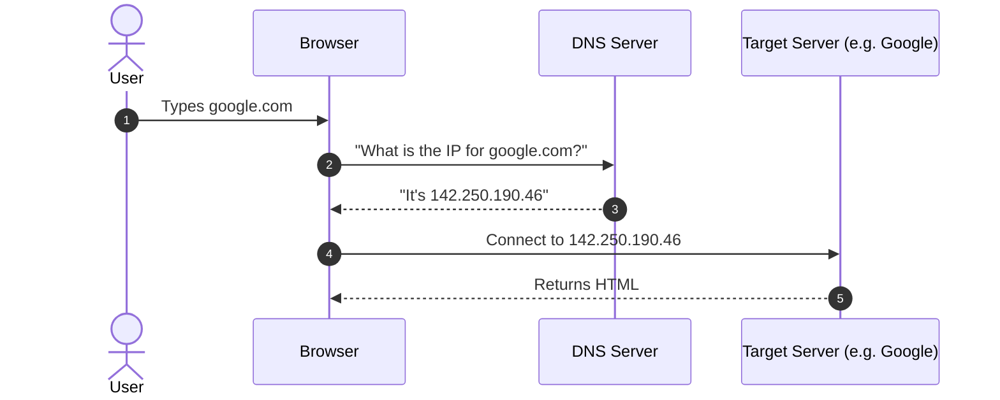
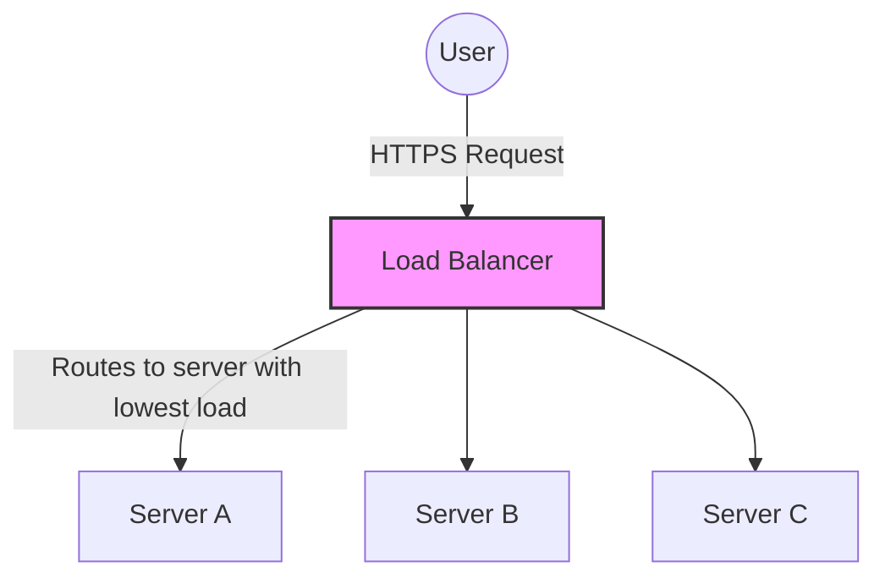
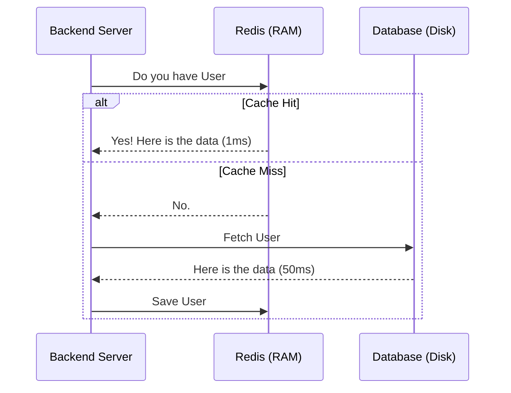
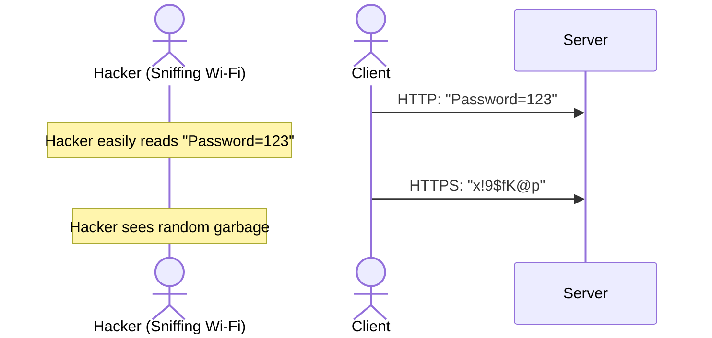

# The Ultimate Backend Engineering Fundamentals Guide

This guide covers the core theoretical and practical concepts that every Backend Engineer must know, from the moment a user types a URL in their browser to the moment data is saved on a hard drive.

---

## 1. The Internet & Networking Basics

### 1.1 What is a Server?
A server is simply a computer. It is no different than your laptop, except it is usually stored in a massive, temperature-controlled warehouse (a data center), doesn't have a monitor attached to it, and is programmed to run 24/7, constantly listening for incoming network requests and "serving" responses.

### 1.2 DNS (Domain Name System)
Computers communicate using IP Addresses (like `192.168.1.1`), but humans prefer names (like `google.com`). DNS is the "phonebook of the internet."

### 1.3 TCP vs UDP
When sending data over the internet, you use a transport protocol:
*   **TCP (Transmission Control Protocol):** Highly reliable. It guarantees delivery and order of packets. If a packet drops, it asks for it again. (Used for Web Browsing, Emails, File Transfers).
*   **UDP (User Datagram Protocol):** Extremely fast but unreliable. It just fires data blindly. If packets drop, they are gone. (Used for Live Video Streaming, Online Gaming).

---

## 2. Infrastructure & Hosting

### 2.1 Reverse Proxy & Load Balancer
A **Reverse Proxy** (like Nginx or HAProxy) sits in front of your internal servers. It hides your internal architecture from the public internet. 
A **Load Balancer** is a type of reverse proxy that evenly distributes incoming traffic across multiple identical servers so no single server gets overwhelmed.

### 2.2 Web Server vs App Server
*   **Web Server (e.g., Apache, Nginx):** Only knows how to serve static files (HTML, CSS, Images). Cannot execute business logic.
*   **Application Server (e.g., Tomcat, Node.js):** Contains the engine to execute dynamic business logic (like our Spring Boot application) and talk to databases.

---

## 3. Application Architecture

### 3.1 Monolith vs Microservices
*   **Monolith:** The entire application (UI, Business Logic, Database Access) is packaged into one massive codebase and deployed as a single unit. Hard to scale, but easy to deploy.
*   **Microservices:** The application is split into dozens of small, independent services (e.g., Payment, User, Inventory). They communicate over the network. Hard to manage, but infinitely scalable.

### 3.2 Caching
Fetching data from a database on a hard drive is incredibly slow. A **Cache** (like Redis or Memcached) stores frequently accessed data in RAM (Memory), making retrieval thousands of times faster.

### 3.3 Message Brokers (Asynchronous Processing)
A Message Broker (like Kafka or RabbitMQ) allows microservices to communicate asynchronously without waiting for a direct response. This prevents catastrophic cascading failures.

---

## 4. Databases

### 4.1 Relational (SQL) vs Non-Relational (NoSQL)
*   **SQL (PostgreSQL, MySQL):** Data is stored in strict, highly structured tables with rows and columns. Great for complex queries and financial data.
*   **NoSQL (MongoDB, DynamoDB):** Data is stored as flexible JSON documents. Great for massive scale and rapidly changing data structures.

### 4.2 ACID Properties
The 4 guarantees a relational database makes during a transaction (like transferring money):
1.  **Atomicity:** "All or Nothing." If part of the transaction fails, the whole thing rolls back.
2.  **Consistency:** The database rules (like unique constraints) are always respected.
3.  **Isolation:** Concurrent transactions don't interfere with each other (preventing dirty reads).
4.  **Durability:** Once committed, the data is saved to disk and survives power outages.

### 4.3 CAP Theorem
In a distributed database system, you can only pick 2 of the following 3 guarantees during a network failure:
*   **Consistency:** Every read receives the most recent write.
*   **Availability:** Every request receives a response (even if it's old data).
*   **Partition Tolerance:** The system continues to operate despite network drops.

---

## 5. Security

### 5.1 Authentication vs Authorization
*   **Authentication (Who are you?):** Logging in with a username and password.
*   **Authorization (What can you do?):** Checking if the logged-in user is an Admin or just a regular Customer.

### 5.2 JWT (JSON Web Tokens)
A stateless, secure string representing a logged-in user. The server generates it after login. The client sends it with every subsequent request. The server mathematically verifies its authenticity without needing to query a database.

### 5.3 HTTPS & TLS/SSL
HTTP sends data in plain text (meaning hackers on your Wi-Fi can read your passwords). HTTPS uses TLS encryption.
1. Client connects to Server.
2. Server sends its Public Key (a padlock).
3. Client uses the padlock to lock its data.
4. Only the Server's Private Key can unlock the data.

