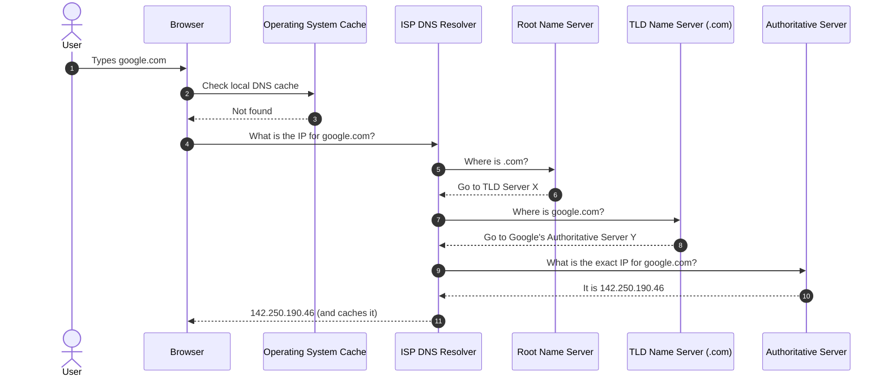
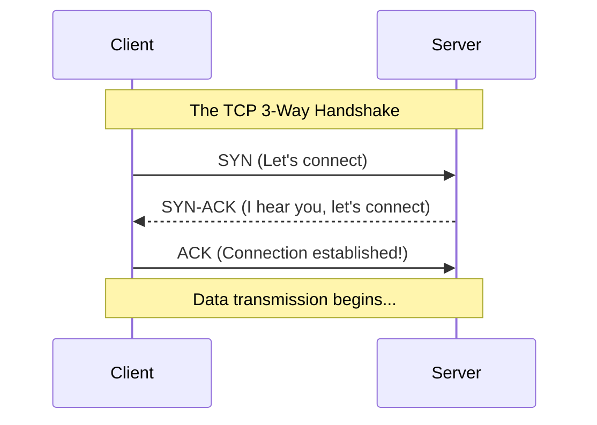
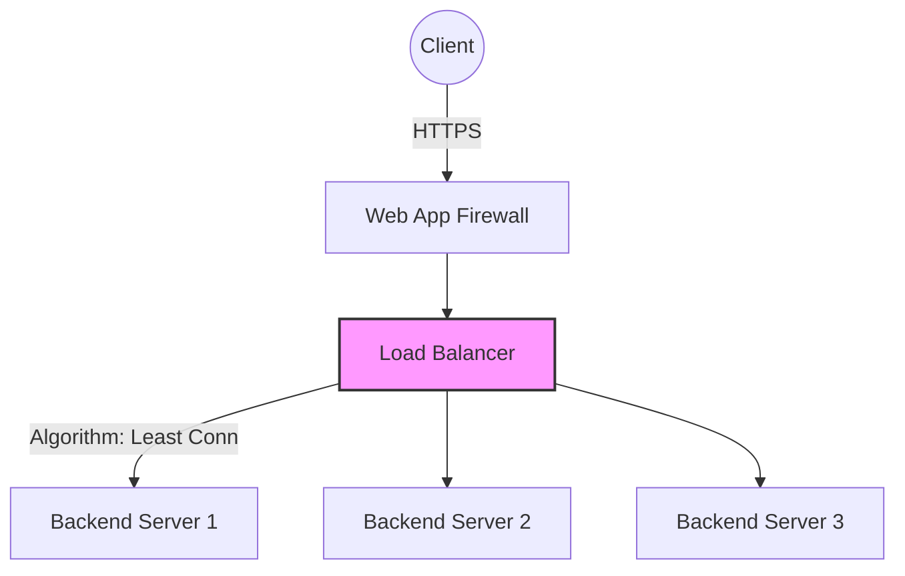
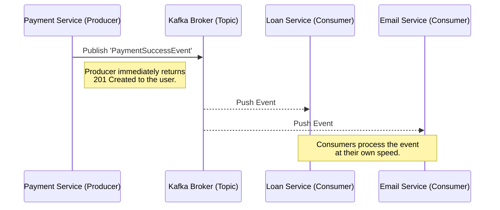
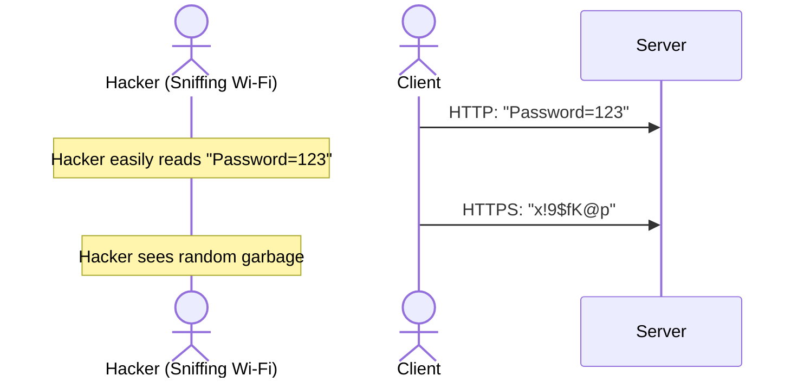

# The Ultimate Backend Engineering Fundamentals Guide

This document is a comprehensive, deep-dive study guide covering the theoretical and practical concepts every Senior Backend Engineer must master. 

---

## 1. Networking & The Internet

### 1.1 What is a Server?
A server is a computer explicitly designed to process requests and deliver data to other computers over a local network or the internet. 
Unlike a personal laptop, a production server:
*   **Has no GUI (Graphical User Interface) or Monitor:** It runs purely via the command line (usually Linux).
*   **Is highly optimized for I/O:** Built with massive amounts of RAM and high-speed network cards.
*   **Lives in a Data Center:** Kept in highly secure, temperature-controlled warehouse racks with redundant power supplies.

### 1.2 DNS (Domain Name System)
Computers communicate using IP Addresses (e.g., `142.250.190.46`), but humans use domain names (`google.com`). DNS acts as the internet's phonebook.

```mermaid
sequenceDiagram
    autonumber
    actor User
    participant Browser
    participant OS as Operating System Cache
    participant Resolver as ISP DNS Resolver
    participant Root as Root Name Server
    participant TLD as TLD Name Server (.com)
    participant Auth as Authoritative Server

    User->>Browser: Types google.com
    Browser->>OS: Check local DNS cache
    OS-->>Browser: Not found
    Browser->>Resolver: What is the IP for google.com?
    Resolver->>Root: Where is .com?
    Root-->>Resolver: Go to TLD Server X
    Resolver->>TLD: Where is google.com?
    TLD-->>Resolver: Go to Google's Authoritative Server Y
    Resolver->>Auth: What is the exact IP for google.com?
    Auth-->>Resolver: It is 142.250.190.46
    Resolver-->>Browser: 142.250.190.46 (and caches it)
```

### 1.3 Transport Protocols: TCP vs UDP
When data leaves your computer, it travels as "packets." The transport protocol dictates *how* those packets are managed.

#### TCP (Transmission Control Protocol)
*   **The Concept:** Highly reliable, connection-oriented. 
*   **How it works:** Before sending data, TCP performs a **3-Way Handshake** to establish a secure connection. It assigns a sequence number to every packet. If a packet drops, the receiver asks the sender to retransmit it. 
*   **Use Cases:** Web Browsing (HTTP), Emails, File Transfers, Database Connections.

```mermaid
sequenceDiagram
    participant Client
    participant Server
    Note over Client, Server: The TCP 3-Way Handshake
    Client->>Server: SYN (Let's connect)
    Server-->>Client: SYN-ACK (I hear you, let's connect)
    Client->>Server: ACK (Connection established!)
    Note over Client, Server: Data transmission begins...
```

#### UDP (User Datagram Protocol)
*   **The Concept:** Fast, connectionless, "fire and forget."
*   **How it works:** It shoots packets blindly at the receiver. There is no handshake, no ordering, and no retransmission of lost packets. 
*   **Use Cases:** Live Video Streaming, Online Multiplayer Gaming, VoIP calls. (If you drop a frame in a video game, you don't want the server to pause the game to resend it; you just want the *next* frame).

---

## 2. Infrastructure & Architecture

### 2.1 Load Balancing & Reverse Proxies
When a system scales to millions of users, one server cannot handle the traffic. You must introduce a Load Balancer (e.g., Nginx, AWS ALB).

*   **Reverse Proxy:** A server that sits in front of your backend servers and forwards client requests to them. It hides the identity of your internal servers, providing massive security benefits.
*   **Load Balancer:** A type of reverse proxy that intelligently distributes traffic across multiple identical backend servers.

**Common Load Balancing Algorithms:**
1.  **Round Robin:** Distributes requests sequentially (Server A, then B, then C, then A...).
2.  **Least Connections:** Sends the request to the server currently handling the fewest active connections.
3.  **IP Hash:** Mathematically hashes the user's IP address to ensure they always connect to the exact same server (useful for Stateful architectures).

```mermaid
flowchart TD
    Client((Client)) -->|HTTPS| WAF[Web App Firewall]
    WAF --> LB[Load Balancer]
    
    LB -->|Algorithm: Least Conn| S1[Backend Server 1]
    LB --> S2[Backend Server 2]
    LB --> S3[Backend Server 3]
    
    style LB fill:#f9f,stroke:#333,stroke-width:2px
```

### 2.2 Monolith vs Microservices
The most critical architectural decision a company makes.

#### Monolith
*   **Definition:** All business logic (Payments, Users, Inventory) is compiled into a single massive codebase and deployed as one unit.
*   **Pros:** Easy to debug, simple to deploy, fast internal method calls (no network latency).
*   **Cons:** Any tiny bug (like a memory leak in the Inventory module) crashes the *entire* application. If only the Payments module is getting heavy traffic, you still have to scale up the entire massive application.

#### Microservices
*   **Definition:** The application is split into dozens of small, independent services. Each service owns its own database.
*   **Pros:** Independent deployments (the Payment team can release code without talking to the Inventory team). Fault isolation (if Inventory crashes, Payments stay online).
*   **Cons:** Extreme complexity. Services must communicate over the unreliable network, requiring Circuit Breakers, Retries, and distributed tracing.

---

## 3. Asynchronous Processing & Message Brokers

In a microservices architecture, synchronous REST API calls (Service A directly calling Service B) are dangerous. If Service B is down, Service A fails. 

**Message Brokers (Kafka, RabbitMQ, AWS SQS)** solve this by introducing asynchronous "Event-Driven" communication.

```mermaid
sequenceDiagram
    participant P as Payment Service (Producer)
    participant K as Kafka Broker (Topic)
    participant L as Loan Service (Consumer)
    participant E as Email Service (Consumer)

    P->>K: Publish 'PaymentSuccessEvent'
    Note right of P: Producer immediately returns <br/> 201 Created to the user.
    
    K-->>L: Push Event
    K-->>E: Push Event
    
    Note over L, E: Consumers process the event<br/>at their own speed.
```

*   **Queues (RabbitMQ/SQS):** Point-to-point. A message is consumed by *one* worker and then deleted. Good for task distribution (e.g., resizing images).
*   **Topics/Streams (Kafka):** Publish-Subscribe. A message is appended to an immutable log. *Multiple* different consumer groups can read the exact same message. Highly scalable and resilient.

---

## 4. Databases Deep Dive

### 4.1 SQL (Relational) vs NoSQL (Non-Relational)

#### SQL (PostgreSQL, MySQL, Oracle)
*   **Structure:** Strict schemas (Tables with Rows and Columns). 
*   **Relationships:** Highly connected data using Primary Keys and Foreign Keys, joined together at read-time (`JOIN`).
*   **Use Cases:** Financial systems, accounting, any application where data integrity and complex querying is paramount.

#### NoSQL (MongoDB, DynamoDB, Cassandra)
*   **Structure:** Flexible schemas (JSON Documents, Key-Value pairs, or Wide-Column).
*   **Relationships:** Data is usually duplicated and embedded together to avoid costly `JOIN` operations.
*   **Use Cases:** Massive scale applications, real-time bidding, user profiles, rapidly changing data structures.

### 4.2 ACID Properties (The SQL Guarantee)
Relational databases guarantee 4 properties for every transaction (like transferring $100 from Alice to Bob):
1.  **Atomicity:** "All or Nothing." If the $100 is deducted from Alice, but the database crashes before giving it to Bob, the entire transaction rolls back. 
2.  **Consistency:** The database rules (e.g., "Balance cannot be negative") are never violated. 
3.  **Isolation:** If two transactions happen at the exact same millisecond, they will not interfere with each other. (Prevents "Dirty Reads").
4.  **Durability:** Once the database says "Committed," the data is physically written to the hard drive. Even if you pull the power cord out of the wall 1 second later, the data survives.

### 4.3 The CAP Theorem
In a distributed database system (a database spread across multiple servers), you can only guarantee 2 of the following 3 properties during a network failure:

1.  **Consistency:** Every read receives the most recent write. (If I update my password, my next read instantly reflects the new password).
2.  **Availability:** Every request receives a response. (The system never goes down, but it might hand you slightly outdated data).
3.  **Partition Tolerance:** The system continues to operate even if the network cable between the servers is cut.

*Note: Because networks on the internet WILL fail, Partition Tolerance (P) is mandatory. Therefore, engineers must choose between CP (Consistency) or AP (Availability).*

---

## 5. Security: Authentication vs Authorization

### 5.1 The Core Difference
*   **Authentication (Who are you?):** Verifying a user's identity via username/password or biometrics. *Analogy: Checking your ID card at the airport.*
*   **Authorization (What are you allowed to do?):** Verifying what resources a user has access to, *after* they are authenticated. *Analogy: Checking your boarding pass to see if you can enter the First Class lounge.*

### 5.2 Types of Authentication

#### 1. Session-Based Authentication (Stateful)
*   **How it works:** You log in. The server creates a "Session ID" and saves it in its RAM. It sends the ID to your browser as a Cookie. On your next click, your browser sends the Cookie. The server looks up the ID in its RAM and allows you in.
*   **Pros:** Secure. The server can instantly kick you out by deleting the session from RAM.
*   **Cons:** Hard to scale. If you have 3 servers behind a Load Balancer, Server B doesn't know about the session created on Server A.

#### 2. Token-Based Authentication (Stateless - JWT)
*   **How it works:** You log in. The server generates a **JSON Web Token (JWT)**, mathematically signs it with a secret key, and hands it to you. **The server saves nothing in RAM.** You send the token in the `Authorization: Bearer` header.
*   **Anatomy of a JWT:**
    1.  *Header:* Algorithm used.
    2.  *Payload:* User ID, Roles, Expiration Date.
    3.  *Signature:* A cryptographic hash proving the token wasn't tampered with.
*   **Pros:** Infinitely Scalable. Any server in the world can verify the signature without checking a database.
*   **Cons:** Cannot easily revoke a token before it expires.

#### 3. OAuth 2.0 & OIDC (Single Sign-On)
Delegating authentication to a massive 3rd party (e.g., "Sign in with Google"). Your application never sees the user's password; Google just hands you a secure token.

### 5.3 Types of Authorization

#### 1. Role-Based Access Control (RBAC)
Access is granted based on broad job titles.
*   *Example:* Only `ROLE_ADMIN` can access the `DELETE /users` endpoint. 

#### 2. Attribute-Based Access Control (ABAC)
Access is granted based on specific details of the data itself.
*   *Example:* Even if John is a `CUSTOMER`, he should only be allowed to view *his own* bank account. The system explicitly checks if `account.owner_id == john.user_id`.

### 5.4 HTTPS & Encryption in Transit
HTTP sends data in plain text. HTTPS uses TLS encryption.
1. Client connects to Server.
2. Server sends its Public Key (a padlock).
3. Client uses the padlock to lock its data (like a password).
4. Only the Server's hidden Private Key can unlock the data.

```mermaid
sequenceDiagram
    actor Hacker as Hacker (Sniffing Wi-Fi)
    actor Client
    participant Server
    
    Client->>Server: HTTP: "Password=123"
    Note over Hacker: Hacker easily reads "Password=123"
    
    Client->>Server: HTTPS: "x!9$fK@p"
    Note over Hacker: Hacker sees random garbage
```

---

## 6. Containerization & Orchestration (Docker & Kubernetes)

### 6.1 Docker (Containerization)

#### The Need
Historically, deploying software was a nightmare known as "Dependency Hell." A developer would write code on a Mac with Java 17, but the production server was Linux with Java 11. The code would crash with the famous excuse: *"Well, it works on my machine!"*

#### The Function
Docker solves this by packaging the application code, the exact Java runtime, the specific Linux OS libraries, and all configurations into a single, indestructible box called a **Docker Image**. 
When you run this Image, it becomes a **Docker Container**. A container is guaranteed to run exactly the same way on your laptop, on a colleague's laptop, and on an AWS production server.

#### Internal Architecture: Docker vs Virtual Machines (VMs)
VMs require a heavy, full "Guest OS" for every single app. Docker shares the Host OS kernel, making containers lightweight, starting in milliseconds instead of minutes.

```mermaid
flowchart TD
    subgraph Virtual Machines (Heavy)
        VM_HW[Hardware] --> Hypervisor
        Hypervisor --> VM1[Guest OS (Linux) + App A]
        Hypervisor --> VM2[Guest OS (Windows) + App B]
    end

    subgraph Docker Containers (Lightweight)
        D_HW[Hardware] --> HostOS[Host OS Kernel]
        HostOS --> DockerDaemon[Docker Daemon]
        DockerDaemon --> C1[Container: App A + Bin/Libs]
        DockerDaemon --> C2[Container: App B + Bin/Libs]
    end
```

### 6.2 Kubernetes (Container Orchestration)

#### The Need
Docker is fantastic for running 3 containers on your laptop. But Toyota Financial Services runs 5,000 containers spread across 50 physical servers. 
*   If Server #4 catches on fire, who restarts its containers on Server #5?
*   If traffic spikes on Black Friday, who automatically duplicates the `payment-service` container 100 times?
*   How do containers on Server #1 find the IP addresses of containers on Server #2?

#### The Function
**Kubernetes (K8s)** is the conductor of the orchestra. It is a massive orchestration platform that automates the deployment, scaling, networking, and self-healing of Docker containers across thousands of servers.

#### Internal Architecture
Kubernetes splits servers into two types: The **Control Plane** (The Brain) and **Worker Nodes** (The Muscle).

```mermaid
flowchart TD
    subgraph Control Plane (The Brain)
        API[API Server: The Front Door]
        ETCD[etcd: The Database / Brain Memory]
        Sched[Scheduler: Assigns Pods to Nodes]
        CM[Controller Manager: Monitors state]
        
        API <--> ETCD
        API <--> Sched
        API <--> CM
    end
    
    subgraph Worker Node 1 (The Muscle)
        Kubelet1[Kubelet: Talks to Brain]
        Proxy1[Kube-Proxy: Networking]
        PodA[Pod: Docker Container A]
        PodB[Pod: Docker Container B]
        Kubelet1 --> PodA
        Kubelet1 --> PodB
    end

    subgraph Worker Node 2 (The Muscle)
        Kubelet2[Kubelet: Talks to Brain]
        Proxy2[Kube-Proxy: Networking]
        PodC[Pod: Docker Container C]
        Kubelet2 --> PodC
    end
    
    API <--> Kubelet1
    API <--> Kubelet2
```

**Key Components:**
1.  **Pod:** The smallest unit in K8s. It is essentially a wrapper around your Docker Container.
2.  **Kubelet:** The agent running on every Worker Node. It listens to the Control Plane and ensures the Docker containers are actually running.
3.  **API Server:** The command center. When you type `kubectl apply`, you are talking directly to the API Server.
4.  **Scheduler:** Looks at a new Docker Container, analyzes how much RAM/CPU it needs, and finds the best Worker Node to place it on.
5.  **etcd:** A highly available Key-Value database that stores the "Desired State" of the entire cluster (e.g., "I must always have 5 Payment Service pods running").

---

## 7. Real-World Enterprise AWS Architecture (TFS Mapping)

When Toyota Financial Services (TFS) deploys a Spring Boot application, they map every local component directly to managed **AWS (Amazon Web Services)** products.

### 6.1 Authentication (Amazon Cognito)
TFS uses **Amazon Cognito**. It handles user registration, stores passwords securely, manages Two-Factor Authentication (MFA), and issues the JWT Tokens to the frontend.

### 6.2 The Front Door (AWS API Gateway & AWS WAF)
*   **AWS WAF (Web Application Firewall)** acts as the ultimate bouncer, blocking malicious IPs and DDoS attacks before they reach the Gateway.
*   **Amazon API Gateway** natively integrates with Cognito. It intercepts the HTTP request, instantly verifies the JWT token's signature, and routes the request to the internal network.

### 6.3 Hosting the Microservices (Amazon EKS)
TFS packages the Spring Boot apps into Docker containers and deploys them to **Amazon EKS (Elastic Kubernetes Service)**. 
*   **Self-Healing:** If a server crashes, EKS automatically spins up a replacement container. 
*   **Auto-Scaling:** EKS automatically duplicates the containers across multiple servers to handle heavy traffic.

### 6.4 The Event Broker (Amazon MSK)
TFS uses **Amazon MSK (Managed Streaming for Apache Kafka)**. AWS manages the Kafka cluster across multiple geographic Data Centers (Availability Zones) so no Kafka events are lost even in a disaster.

### 6.5 The Database (Amazon RDS)
TFS uses **Amazon RDS (Relational Database Service)**. RDS automatically handles nightly database backups, software patching, and synchronizes data to a secondary database in real-time.
